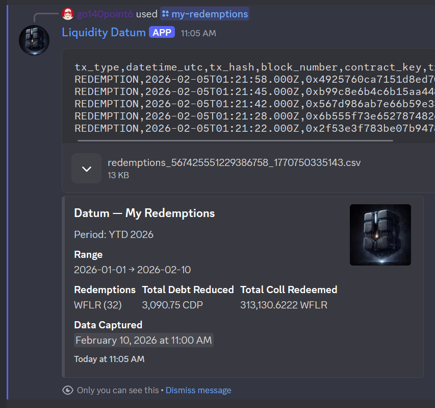
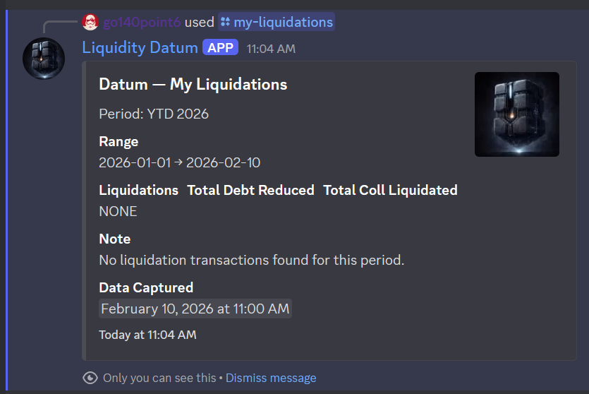
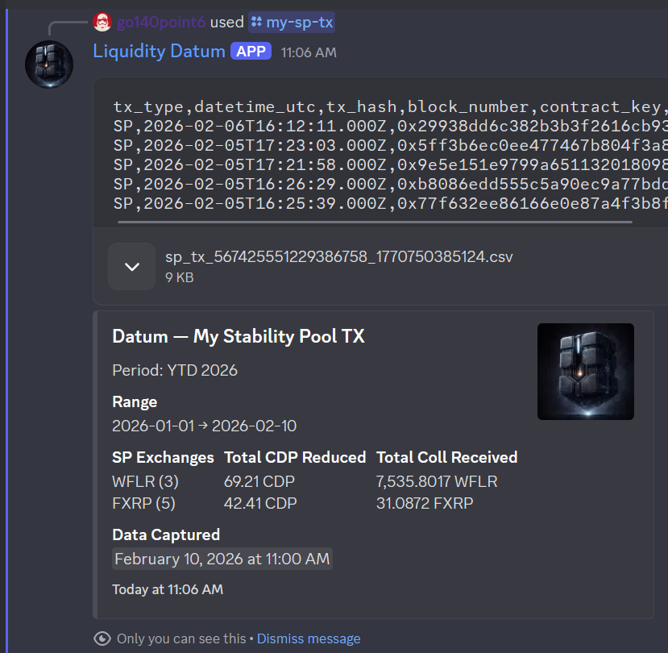
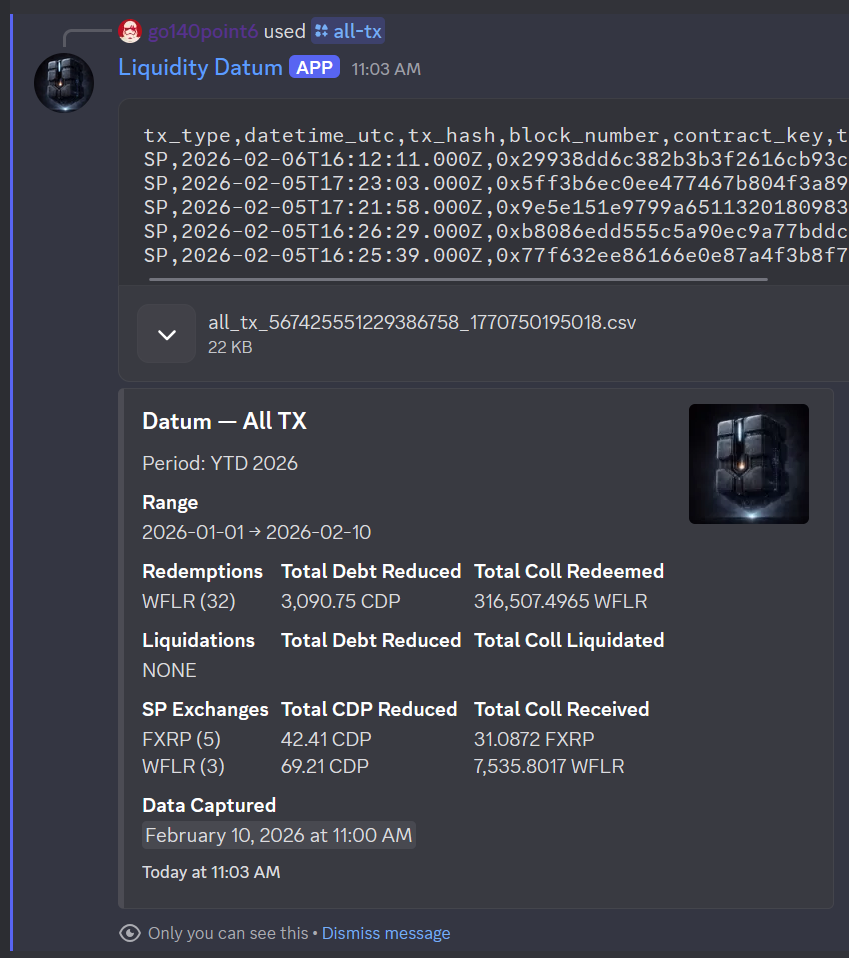

# Liquidity Datum

Liquidity Datum is a Discord bot for exporting Liquity v2 fork activity into clean, tax‑friendly CSVs. It focuses on *what happened* (redemptions, liquidations, stability pool exchanges) and gives you a clear audit trail you can filter and analyze in a spreadsheet.

---

## Features at a glance

### /my-redemptions
Redemption history with totals by collateral, clear period filtering, and downloadable CSV.

### /my-liquidations
Liquidation history (if any) with per‑collateral totals and CSV export.

### /my-sp-tx
Stability pool activity with exchange summaries and CSV export.

### /all-tx
Combined view across redemptions, liquidations, and stability pool events for a full‑period export.

---

## What the bot delivers

- **Consistent CSV formats** across commands, with common core fields.
- **Time‑range filtering** (YTD, prior years, all time).
- **Clear summaries** so you can see totals at a glance.
- **Data freshness** indicators based on scan completion time.

---

## License

MIT
